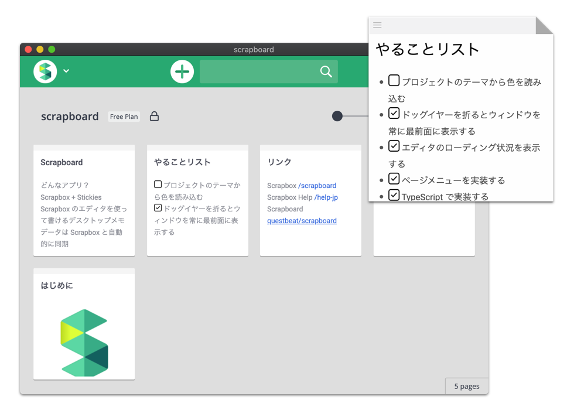

# Scrapboard


Sticky Notes for Scrapbox




## Installation

Download a package from [releases](https://github.com/questbeat/scrapboard/releases) page.


## Manual Build

```sh
# Install packages
yarn install

# Build the app and output it to the "build" directory
yarn build

# Create a package and output it to the "dist" directory
yarn dist
```


## Development

```sh
# Install packages
yarn install

# Launch webpack and monitoring file changes
yarn dev

# Launch the app
yarn start
```


## License

Scrapboard is [MIT Licensed](LICENSE).
